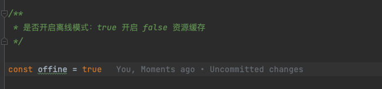
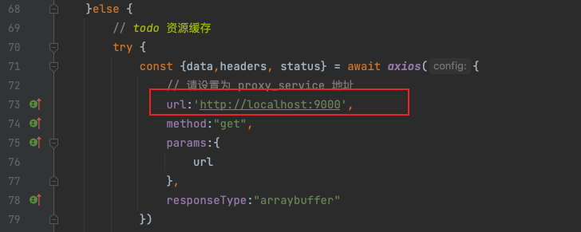

# resource-offline

资源离线服务，包含代理服务

## 目录说明：

### offline-serve 离线服务

### proxy_service 代理服务

## 使用教程

高德地图离线方案，请修改配置本地 host 如下：

```
 127.0.0.1       webapi.amap.com
 127.0.0.1       restapi.amap.com
 127.0.0.1       vdata.amap.com
 127.0.0.1       vdata01.amap.com
 127.0.0.1       vdata02.amap.com
 127.0.0.1       vdata03.amap.com
 127.0.0.1       vdata04.amap.com
```

具体配置方案根据对应的操作系统来

[offline-serve/serve.ts](offline-serve/serve.ts)

以下代码控制资源是否缓存或离线



以下代码服务地址，请指向代理服务



